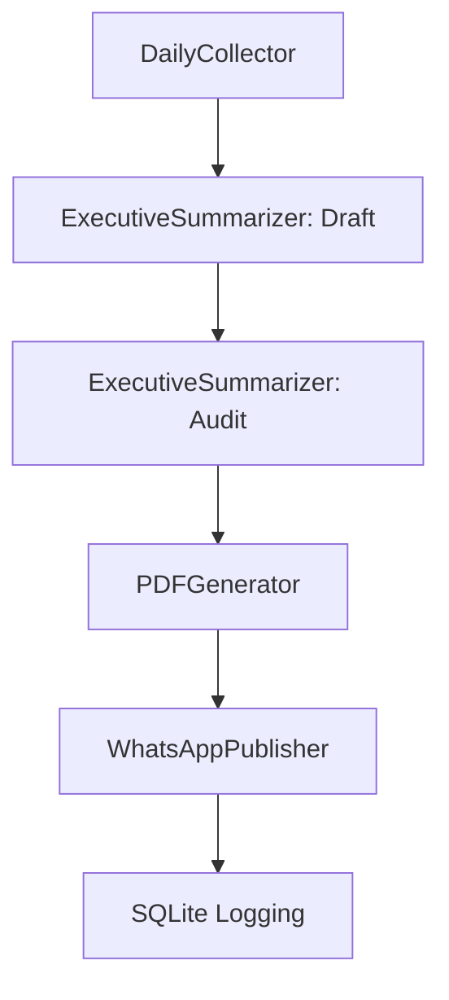

# AGP (Autonomous Group Publisher) - Project-Scoped Agent Context

This is the official workspace rules and context file for the AGP project. Antigravity (and other compatible AI coding assistants) will automatically load and follow these guidelines when working in this project.

---

## 🎯 1. Project Overview & Architecture
AGP is an autonomous serverless ETL system that:
1. Gathers AI market news using `google-genai` and `gemini-2.5-pro`.
2. Synthesizes a daily executive report using a 2-agent loop.
3. Generates a PDF via `xhtml2pdf` using pre-styled responsive HTML/CSS.
4. Delivers the PDF to a WhatsApp group via the Evolution API `/message/sendMedia` endpoint.
5. Logs execution metadata (SUCCESS/ERROR) inside a local SQLite database (`agp_database.db`).

### Pipeline Execution Flow


---

## 👮 2. Agent Constraints & Business Rules (CRITICAL)
Whenever modifying text generation prompts or output validators, the following constraints must be strictly adhered to:

### A. Linguistic & Compliance Rules
- **No Oblique Pronouns at Start of Sentences:** NEVER let a sentence or paragraph start with "Me", "Te", "Se", "Nos", "Vos" (e.g., replace *"Me parece que..."* with *"Parece-me que..."*).
- **Mandatory PDF Header:** Every executive report must have the following header block exact structure:
  ```markdown
  # I.A. Nível 01
  ## José S.O. Junior (43) 9 8859-7348
  🔗 **Grupo de WhatsApp:** [Acesse aqui]({LINK_GROUP})
  **Data:** {current_date}
  ```
- **Preserve References:** AI agents must retain all factual URLs and links from source material.
- **Mandatory End Signature:** Every generated report must end with this exact, isolated sentence: `"Até a próxima edição."`

### B. PDF Formatting Guidelines (xhtml2pdf limitations)
- HTML page structure requires exact `@page { size: a4 portrait; margin: 2cm; }`.
- Allowed fonts are standard sans-serif (`Helvetica`, `Arial`). Do not use web-fonts unless fully embedded.
- Text color must be `#333333` (Graphite) with title colors `#1E3A8A` (Deep Blue) and links `#2563EB`.

---

## 🛠️ 3. Execution & Testing Commands
- **Local Run:** `python3 autonomous_publisher.py`
- **Testing:** `python3 -m pytest test_suite.py -v`
- **Docker Build & Run:**
  ```bash
  docker compose up -d --build
  ```
- **Docker Log Check:** `docker compose logs` (ensure `ENV PYTHONUNBUFFERED=1` is preserved in `Dockerfile`).

---

## 🔒 4. Environment Variables (.env Template)
Ensure the following keys are populated in your local `.env` file (never commit actual `.env` keys to Git):
```env
GEMINI_API_KEY="AIzaSy..."
WHATSAPP_API_URL="https://evolution.projetobrasil2050.site/message/sendMedia/01"
WHATSAPP_API_TOKEN="6CBB7DCE6D50-..."
WHATSAPP_GROUP_ID="120363410789564152@g.us"
LINK_GROUP="https://chat.whatsapp.com/DJDWRobITde5Mc7SZ4De1R"
DATABASE_PATH="agp_database.db"
```
