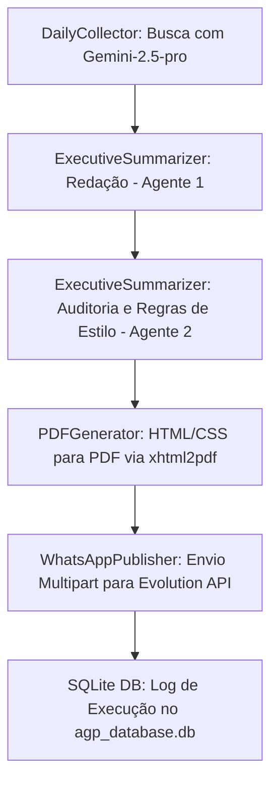

# Autonomous Group Publisher (AGP) - Resumo de Contexto do Projeto

Este arquivo documenta o estado atual, a arquitetura e o progresso do projeto **AGP (Autonomous Group Publisher)**, consolidado em **26 de Junho de 2026**.

---

## 🎯 Objetivo e Fluxo de Execução
O AGP é um sistema autônomo projetado para rodar diariamente (via Agendador de Tarefas do Windows ou VPS/Docker) realizando a curadoria de notícias de Inteligência Artificial e publicando um resumo executivo formatado diretamente em um grupo do WhatsApp.



---

## 📂 Arquivos na Pasta e Funções
* **`autonomous_publisher.py`**: O script principal que orquestra o ETL e as interações com a API do Gemini.
* **`test_suite.py`**: Suíte de testes automatizados com Pytest que valida regras de negócio e geração do PDF.
* **`run_daily.bat`**: Script de lote para Windows criado para automatizar a execução diária.
* **`agp_database.db`**: Banco de dados SQLite local contendo o histórico de logs das execuções (`execution_logs`).
* **`requirements.txt`**: Declaração das dependências Python necessárias.
* **`.env`**: Configuração das credenciais (Gemini API Key e variáveis do WhatsApp).
* **`CONTEXT.md`**: Detalhes conceituais e comandos básicos de setup.
* **`PROMPTS.md`**: Definição dos prompts e das regras estéticas aplicadas pela inteligência artificial.

---

## 🛠️ Alterações e Melhorias Recentes (Concluídas em 26/06/2026)
1. **Migração do SDK da Gemini**:
   * Substituição do pacote legado `google-generativeai` pelo moderno **`google-genai`**.
   * O código foi totalmente refatorado para utilizar a inicialização do cliente `client = genai.Client()` e chamadas limpas aos modelos `gemini-2.5-pro`.
2. **Correção nos Testes Unitários**:
   * Alinhamento da assinatura esperada de encerramento nos testes em `test_suite.py`. Agora valida `"Até a próxima edição."` (consistente com o script principal e o `PROMPTS.md`).
3. **Estabilização de Referências e Links**:
   * Reversão do recurso experimental de Google Search Grounding em favor das respostas internas consolidadas do modelo, garantindo que as fontes e os links das matérias (Llama 3, Meta AI, etc.) saiam sempre formatados corretamente, idênticos à edição bem-sucedida de 25/06.
4. **Automação**:
   * Criação do script de execução `run_daily.bat` e documentação de integração com o Agendador de Tarefas do Windows.

---

## ⚙️ Como Executar e Testar

### Instalação de Requisitos
```powershell
pip install -r requirements.txt
```

### Executar a Suíte de Testes
```powershell
python -m pytest test_suite.py -v
```

### Execução Manual do Robô
```powershell
python autonomous_publisher.py
```

---

## 📌 Próximos Passos e Integrações Pendentes
* **WhatsApp Real**: A integração com a Evolution API está em modo simulado no script `autonomous_publisher.py` (linhas 219-223). Quando as URLs reais da instância do WhatsApp e o token estiverem definidos no arquivo `.env`, o envio de mídia físico poderá ser descomentado para a publicação real.
