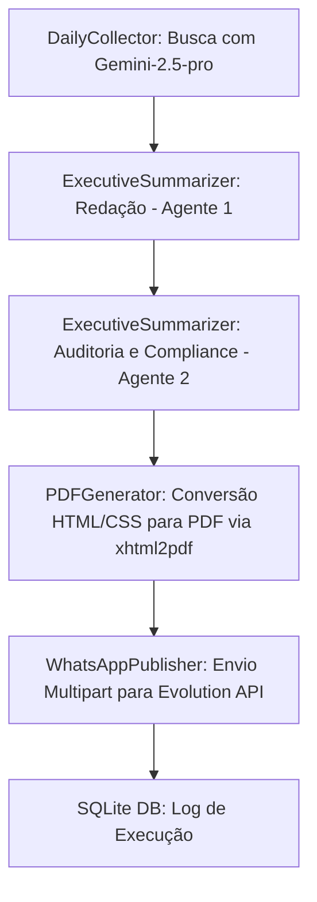

# 📄 Contexto de Desenvolvimento: AGP (Autonomous Group Publisher)

Este documento foi preparado para servir de **contexto e instruções completas** para o assistente de I.A. que continuará o desenvolvimento do projeto **AGP** no seu notebook.

---

## 🎯 1. Visão Geral do Projeto
O **AGP** é um robô autônomo escrito em Python projetado para:
1. **Coletar** novidades e notícias sobre I.A. (modelos, aplicações, open source, movimentações de grandes empresas).
2. **Redigir e Auditar** um relatório diário formatado em Markdown utilizando um fluxo multi-agente executado no modelo `gemini-2.5-pro` (via SDK moderno `google-genai`).
3. **Gerar um PDF** mobile-friendly formatado via `xhtml2pdf`.
4. **Publicar** o PDF de forma física (via multipart/json) no WhatsApp usando a **Evolution API**.
5. **Registrar** as execuções com sucesso/erro em um banco de dados local SQLite (`agp_database.db`).

---

## 🏗️ 2. Arquitetura do Pipeline Multi-Agente
O pipeline é síncrono e sequencial, permitindo fail-fast se algum passo falhar:



### Regras de Negócio e Compliance Estritas (Auditadas pelo Agente 2):
1. **Pronome Oblíquo:** NUNCA iniciar frases ou parágrafos com pronomes oblíquos ("Me", "Te", "Se", "Nos", "Vos"). Ex: Substituir *"Me parece..."* por *"Parece-me..."*.
2. **Integridade de Links:** Manter sempre as fontes e links de referência intactos no Markdown final.
3. **Estrutura Obrigatória de Cabeçalho:**
   * Título principal: `# I.A. Nível 01`
   * Subtítulo: `## José S.O. Junior (43) 9 8859-7348`
   * Link do grupo: `🔗 **Grupo de WhatsApp:** [Acesse aqui]({LINK_GROUP})`
   * Data atual: `**Data:** DD/MM/AAAA`
4. **Assinatura Obrigatória:** O texto final DEVE terminar exatamente com a frase isolada: `"Até a próxima edição."`

---

## 📂 3. Estrutura dos Arquivos do Projeto
* **`autonomous_publisher.py`**: Arquivo principal com a lógica de ETL, chamadas ao Gemini, geração de PDF e postagem da Evolution API.
* **`scheduler.py`**: O agendador configurado para a timezone `America/Sao_Paulo` executando diariamente às **08:00**.
* **`test_suite.py`**: Suíte de testes unitários escrita em Pytest para certificar conformidade de texto e integridade física do PDF.
* **`Dockerfile` & `docker-compose.yml`**: Infraestrutura Docker de deploy em VPS com unbuffering de logs (`PYTHONUNBUFFERED=1`).
* **`.env`**: Configuração local das variáveis sensíveis (Ignorado no Git).

---

## ⚙️ 4. Configuração das Variáveis de Ambiente (`.env`)
Ao iniciar o desenvolvimento no notebook, certifique-se de configurar o arquivo `.env` com esta estrutura:
```env
GEMINI_API_KEY="SUA_CHAVE_API_GEMINI"
WHATSAPP_API_URL="https://evolution.projetobrasil2050.site/message/sendMedia/01"
WHATSAPP_API_TOKEN="6CBB7DCE6D50-4851-A607-F2EC2C1580C2"
WHATSAPP_GROUP_ID="120363410789564152@g.us"
LINK_GROUP="https://chat.whatsapp.com/DJDWRobITde5Mc7SZ4De1R"
DATABASE_PATH="agp_database.db"
```

---

## 🛠️ 5. Instruções para Executar e Testar no Notebook

### Passo 1: Instalação das dependências
```bash
pip install -r requirements.txt
```

### Passo 2: Rodar a suíte de testes unitários
```bash
python -m pytest test_suite.py -v
```

### Passo 3: Executar o robô manualmente para testar o fluxo completo
```bash
python autonomous_publisher.py
```

---

## 🚀 6. Próximos Passos e Oportunidades de Melhoria
Caso queira expandir o sistema, estas são as melhorias planejadas:
1. **Evitar Conteúdo Duplicado (Histórico):** Consultar o SQLite no início do pipeline para passar ao Gemini quais notícias já foram publicadas em dias anteriores, evitando repetições.
2. **Template HTML Visual Premium:** Melhorar o design CSS do PDF (no objeto `PDFGenerator.css`) para incluir elementos como bordas arredondadas e divisores modernos.
3. **Tratamento de Falhas com Alerta:** Adicionar uma notificação por email ou mensagem privada de WhatsApp caso o pipeline principal falhe em alguma etapa crítica.
